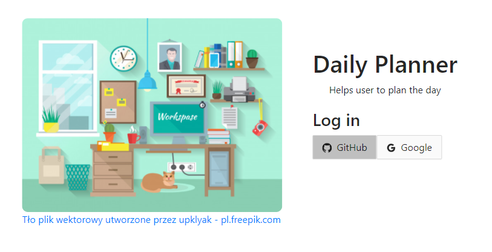
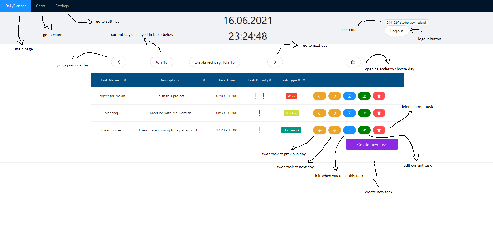
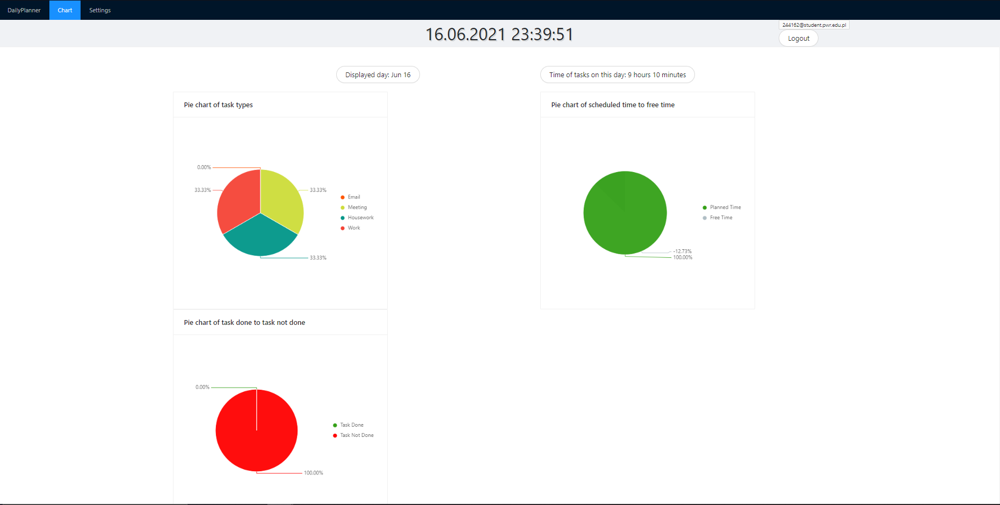
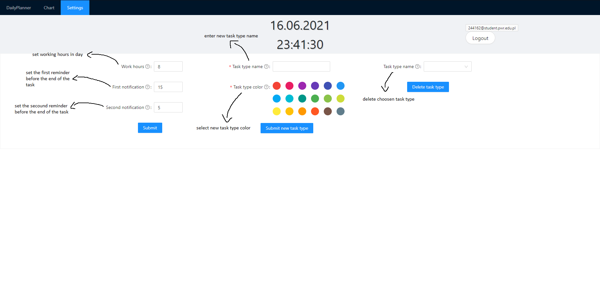

# Daily Planner
# Table of contents
<!--ts-->
   * [How to run](#how-to-run)
   * [About aplication](#about-aplication)
   * [Usage](#usage)
   * [Heroku deployment](#heroku-deployment)
<!--te-->

## How to run:
Install virtual evnivorment and activate it.
```bash
python -m venv .venv
.venv\Scripts\activate
```

Next go to daily_planner folder and install django from requirements.txt.
```bash
cd daily_planner
pip install -r requirements.txt
```

Run server.
```bash
python manage.py migrate
python manage.py runserver
```

Go to fontend folder, install npm and start Daily Planner!
```bash
cd frontend
npm install
npm start
```

## About aplication
The goal of our project is to solve the following problem that we have a lot of tasks during the day,
often new ones appear, which may lead to impaired performance of the current tasks or
forgetting about them. Many tasks may move to the next day, change priorities or times
task instances. Our application is designed to support this process, controlling tasks to
be completed by introducing prioritization, easy postponement to the next day, and
the ability to see the statistics.

## Usage

Login window:
<div style="text-align:center">

</div>


Main page:
<div style="text-align:center">

</div>


Charts:
<div style="text-align:center">

</div>


Settings:
<div style="text-align:center">

</div>

## Heroku deployment
[Daily planner online](https://daily-planner-demo.herokuapp.com)
You can see our work without downloading end installing everything :)

## Contributors
- [Łukasz Gancarz](https://github.com/lukaszgancarz98)
* [Damian Mańkowski](https://github.com/DamianMankowski)
* [Artur Urzędowski](https://github.com/DamianMankowski)
* [Tomasz Talaga](https://github.com/TomekPaluch)
* [Ewa Kaczmarek](https://github.com/ekaczmar)
* [Maciej Bakowicz](https://github.com/bakowroc)
* [Karol Szymończyk](https://github.com/karolszymonczyk)
